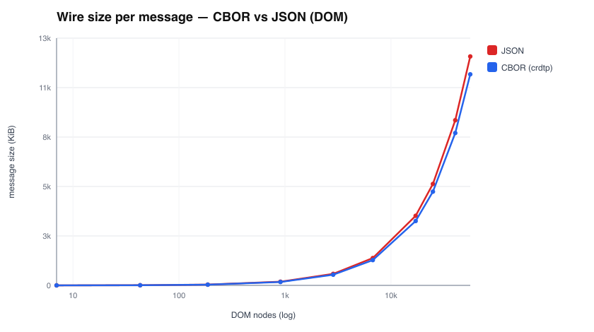
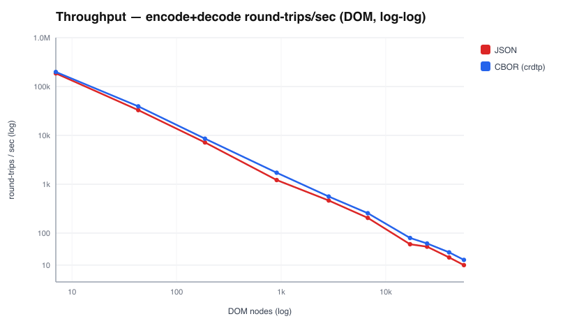
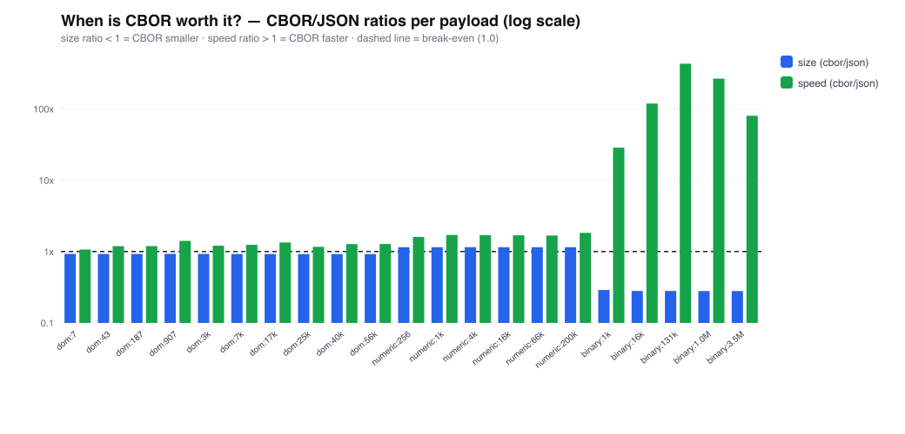

# rust-cdp

A **minimal, typed Chrome DevTools Protocol (CDP) client in Rust that talks
CBOR, not JSON** — over Chrome's `--remote-debugging-pipe=cbor` file-descriptor
pipe instead of the usual JSON-over-WebSocket.

It launches Chrome, creates a tab, attaches to it, navigates to a URL, and
reads the page title — using the strongly-typed command structs from
[`chromiumoxide_cdp`] encoded with a hand-written serde codec for Chrome's CBOR
dialect.

```console
$ cargo run -- https://www.rust-lang.org
URL:   https://www.rust-lang.org
TITLE: Rust Programming Language
```

---

## Why this is unusual

Every other Rust CDP client speaks **JSON**:

| Project | Transport | Encoding |
|---|---|---|
| `chromiumoxide` | WebSocket | JSON |
| `headless_chrome` | WebSocket | JSON |
| `cdp-use-rs`, `cdp-lite`, … | WebSocket | JSON |
| `chromist`, `ferridriver` | **pipe (fd 3/4)** | **NUL-delimited JSON** |

The `--remote-debugging-pipe=cbor` flag and Chrome's "crdtp" CBOR wire format
appear only in Chromium itself and in JS/C++ launchers (chrome-launcher, CEF).
**No existing Rust crate implements a CBOR CDP client** — so the CBOR codec here
is written from scratch against the upstream Chromium spec.

---

## How the whole thing works

```
┌─────────────────────────────┐         ┌──────────────────────────────┐
│  rust-cdp (this crate)      │         │  Google Chrome               │
│                             │         │  --remote-debugging-pipe=cbor│
│  chromiumoxide_cdp structs  │         │                              │
│        │  (typed)           │         │                              │
│        ▼                    │  fd 3   │                              │
│  CDP request {id,method,    │ ──────▶ │  reads commands  (fd 3)      │
│   params,sessionId}         │  CBOR   │                              │
│        │                    │         │                              │
│  cbor::to_vec (crdtp dialect)         │  writes responses/events     │
│        ▼                    │  fd 4   │                  (fd 4)      │
│  cbor::from_slice  ◀────────│ ◀────── │                              │
│        │                    │  CBOR   │                              │
│        ▼                    │         │                              │
│  typed C::Response          │         │                              │
└─────────────────────────────┘         └──────────────────────────────┘
```

There are three layers, one per source file.

### 1. The transport — `src/pipe.rs`

Chrome's pipe transport (upstream:
[`content/browser/devtools/devtools_pipe_handler.cc`][pipe-handler]) works like
this:

* The browser **reads incoming commands from fd 3** and **writes outgoing
  messages to fd 4** (from the browser's point of view).
* The mode is chosen by the flag value:
  ```cpp
  mode_ = str_mode == "cbor" ? ProtocolMode::kCBOR
                             : ProtocolMode::kASCIIZ;  // NUL-delimited JSON
  ```
* In **JSON (`kASCIIZ`) mode** messages are delimited by a `\0` byte.
* In **CBOR (`kCBOR`) mode there is no delimiter** — each message is a
  self-describing CBOR *envelope* that carries its own byte length, so the
  reader peeks the length header and reads exactly that many bytes:
  ```cpp
  // tag tag_type? byte_string length*4 map_start
  const size_t kPeekSize = 8;
  auto status_or_header = crdtp::cbor::EnvelopeHeader::ParseFromFragment(...);
  const size_t msg_size = (*status_or_header).outer_size();
  buffer.resize(msg_size);
  ```

`PipeConn::spawn` reproduces this:

1. Creates two `pipe(2)` pairs.
2. Uses `Command::pre_exec` to `dup2` them onto **fd 3** and **fd 4** in the
   child before `exec`. *Ordering matters:* `pipe(2)` returns the lowest free
   fds, so the parent-only ends are closed **first** to free fd numbers 3/4,
   then duped into place — otherwise the output pipe gets clobbered and Chrome
   exits immediately with `Connection terminated while reading from pipe`.
3. Launches Chrome with `--remote-debugging-pipe=cbor --headless=new`.

`recv_raw` buffers bytes and uses `cbor::message_len` to peel off exactly one
envelope frame at a time.

### 2. The CBOR codec — `src/cbor/`

This is the heart of the project: a serde `Serializer` and `Deserializer` for
Chrome's CBOR dialect, so **any serde-derived type round-trips unchanged**.

Chrome's CBOR is **not** standard RFC 7049/8949 CBOR. The rules (from
[`third_party/inspector_protocol/crdtp/cbor.h`][cbor-h] /
[`cbor.cc`][cbor-cc]) are:

* **Maps and arrays are wrapped in an "envelope"** — a CBOR tag (24) followed
  by a byte string whose 32-bit length gives the wrapped item's size. This lets
  a decoder skip whole subtrees. Every map/array, nested or not, is enveloped.
* **Maps and arrays use indefinite length** (`0xBF`/`0x9F` … `0xFF`).
* **At the top level, a message is an indefinite-length map wrapped in an
  envelope.**
* Scalars stay in the **int32 range**, encoded as major type 0 (unsigned) /
  1 (negative).
* Strings are UTF-8 (major type 3); binary is a byte string (major type 2)
  prefixed with tag 22 ("expect base64").
* Doubles are major type 7, additional-info 27, 8 bytes big-endian.

The exact byte layout of a top-level message:

```
D8 18 5A  <u32 be length>   BF   <key/value pairs…>   FF
└┬─────┘  └────┬────────┘   └┬┘                       └┬┘
 envelope      payload len   indef-map start         stop byte
 tag (24)      (big-endian)
```

`src/cbor/consts.rs` derives every constant from CBOR's `initial = (major << 5)
| info` rule, so the magic bytes (`0xD8`, `0x5A`, `0xBF`, `0xFF`, …) are
computed, not guessed.

`src/cbor/ser.rs` (`to_vec`):
* `open_envelope` writes `D8 18 5A` + a 4-byte length placeholder and remembers
  the offset; `close_envelope` back-patches the length once the contents are
  written.
* structs/maps → enveloped indefinite map; sequences → enveloped indefinite
  array; ints → major type 0/1; enums → their string name.

`src/cbor/de.rs` (`from_slice`):
* `skip_envelope` transparently steps over the tag + byte-string header
  wherever a map/array is expected.
* indefinite maps/arrays are read until the `0xFF` stop byte.
* `message_len` parses just the envelope header to tell the pipe reader how
  many bytes make one frame.

Round-trip and exact-byte tests live in `src/cbor/mod.rs` (`cargo test`).

### 3. The typed client — `src/client.rs` + `src/main.rs`

`chromiumoxide_cdp` provides the pre-existing **typed CDP layer**: every command
is a struct implementing [`chromiumoxide_types::Command`], which ties it to its
method id (e.g. `"Page.navigate"`) and its associated `Response` type.

`Client::execute`:
1. Wraps a typed command in the CDP request envelope
   `{ id, method, params, sessionId }`.
2. Encodes it with `cbor::to_vec` and writes it to the pipe.
3. Pumps inbound frames, skipping events and mismatched ids, until the response
   with the matching `id` arrives.
4. Decodes `result` into the command's `Response` type (via `serde_json::Value`
   as the bridge, since the chromiumoxide types are serde-based).

`main.rs` runs the demo flow:

```
Target.createTarget(about:blank)   →  target id
Target.attachToTarget(flatten)     →  session id   (lets us drive the tab
                                                      over one pipe)
Page.navigate(url)            [on session]
Runtime.evaluate(document.readyState)  [poll until "complete"]
Runtime.evaluate(document.title)   →  the title
```

---

## Running

Requirements: a Rust toolchain and Google Chrome (or Chromium).

```console
# default URL is https://example.com
cargo run

# navigate to a specific URL
cargo run -- https://www.rust-lang.org

# point at a different browser binary
CHROME_PATH=/path/to/chromium cargo run -- https://example.com

# see Chrome's own stderr (for debugging the pipe)
CDP_DEBUG=1 cargo run
```

Run the codec tests:

```console
cargo test
```

## Benchmarks — is CBOR worth it?

`cargo run --release --example bench_sweep` sweeps three payload shapes that
map to real CDP responses, scaling each up to ~5 MB, and writes a CSV plus
three SVG charts to `bench/`. It measures wire size, encode/decode time, and
round-trip throughput.

**The answer depends entirely on payload shape:**

| Shape | Example CDP call | Size (CBOR vs JSON) | Round-trip speed |
|---|---|---|---|
| **DOM** (string-heavy) | `DOM.getDocument` | **~8% smaller** | ~1.0–1.4× (slight CBOR win) |
| **Numeric** (ints/floats) | `Profiler.takeCoverage` | **~15% *larger*** † | ~1.3–1.9× CBOR |
| **Binary** (blobs) | `Page.captureScreenshot` | **~72% smaller** | **20–840× CBOR** |

† crdtp wraps *every* sub-array in a 7-byte envelope, so arrays of tiny tuples
(coverage ranges) actually cost more bytes than JSON — a real, measured
gotcha, not a guess.





**Takeaways**

* For **lots of DOM**, CBOR is modestly smaller and roughly ties-to-slightly-
  faster — the codec, not the wire, dominates, and `serde_json` is extremely
  well optimized.
* For **binary** responses (screenshots, `Network.getResponseBody`, PDFs) CBOR
  is a runaway win: JSON must base64-encode (**+33% size**) *and* escape every
  byte, while CBOR sends raw bytes. This is where the CBOR pipe earns its keep.
* For **numeric** data CBOR is faster but can be *larger* due to envelope
  overhead — worth knowing before assuming "binary format = smaller".

### Client efficiency

`Client::execute` decodes each CBOR reply **directly into the typed response**
in a single pass — no intermediate `serde_json::Value` tree. Measured at
**~1.5× faster decode** vs the two-pass route (`bench_decode_paths`).

### Where the time goes (profiling)

`cargo run --release --example profile` breaks the codec down with
single-dimension payloads and an A/B of candidate optimizations. Findings that
drove the current code:

* **Decode dominates** — encode runs ~900–1400 MB/s, decode ~200–1000 MB/s
  depending on shape. The codec is **CPU-bound, not memory-bound** (a raw
  byte-scan of the same buffer runs at ~40–60 GB/s).
* **`#[inline]` on the hot parse/emit primitives** (`read_token`, `peek`,
  `take`, `write_token_start`) was the single biggest win — roughly **2× on
  integer decode** and a large bump everywhere, because it lets the optimizer
  fuse the per-token bounds checks. This is the main reason CBOR now beats
  `serde_json` on encode for every shape and on decode for ints/DOM.
* **Removing a redundant byte read** in `deserialize_any` (it peeked the
  initial byte, then `read_token` re-read it) shaves a bounds check per token
  on the parse-bound integer path.
* **Decode cost split** (DOM): ~40% parsing, ~60% serde struct-building. The
  struct-building half is `String`/`Vec` allocation that's inherent to *owned*
  deserialization — `serde_json` pays the identical cost, so it's not
  addressable without borrowed types (which the chromiumoxide types don't use).
  This is also why JSON stays marginally ahead on the pure-string decode case.
* **Buffer reuse** (`cbor::to_buf`, used by `Client`) avoids a per-message
  allocation. The microbenchmark gain is in the noise (the allocator caches the
  freed block), but it's free and matters under allocator pressure / many
  concurrent clients.

## Layout

```
src/
  lib.rs         library crate (cbor / client / pipe modules)
  main.rs        demo: spawn → create target → attach → navigate → get title
  client.rs      typed Client over the pipe (chromiumoxide_cdp commands)
  pipe.rs        spawn Chrome with the CBOR pipe; fd 3/4 transport + framing
  cbor/
    mod.rs       module entry + round-trip tests + codec benchmarks
    consts.rs    crdtp CBOR byte constants (derived from major/info rules)
    ser.rs       serde Serializer → crdtp CBOR
    de.rs        serde Deserializer ← crdtp CBOR + frame length parsing
examples/
  bench_sweep.rs CBOR-vs-JSON sweep across payload shapes; emits CSV + SVGs
  profile.rs     codec profiler: per-component breakdown + optimization A/Bs
bench/           generated benchmark results (CSV + charts)
```

## Limitations

This is intentionally minimal:

* Synchronous, single-threaded request/response; events are read and discarded
  (the message pump skips anything without a matching id).
* No automatic `Target`/session lifecycle management beyond the demo flow.
* The CBOR codec covers the subset of the dialect CDP actually uses (UTF-8
  strings, int32 scalars, doubles, bool/null, enveloped maps/arrays, base64
  binary). UTF-16 byte-strings and CBOR tuple/struct-variant enums are not
  emitted (CDP never uses them) and are rejected rather than mis-encoded.

## References

* Chrome flag — [`content/public/common/content_switches.cc`][switches]
  (`kRemoteDebuggingPipe`)
* Pipe transport — [`content/browser/devtools/devtools_pipe_handler.cc`][pipe-handler]
* CBOR dialect spec — [`third_party/inspector_protocol/crdtp/cbor.h`][cbor-h]
  / [`cbor.cc`][cbor-cc]
* Typed CDP types — [`chromiumoxide_cdp`] / [`chromiumoxide_types`]

[switches]: https://source.chromium.org/chromium/chromium/src/+/main:content/public/common/content_switches.cc
[pipe-handler]: https://source.chromium.org/chromium/chromium/src/+/main:content/browser/devtools/devtools_pipe_handler.cc
[cbor-h]: https://source.chromium.org/chromium/chromium/src/+/main:third_party/inspector_protocol/crdtp/cbor.h
[cbor-cc]: https://source.chromium.org/chromium/chromium/src/+/main:third_party/inspector_protocol/crdtp/cbor.cc
[`chromiumoxide_cdp`]: https://crates.io/crates/chromiumoxide_cdp
[`chromiumoxide_types`]: https://crates.io/crates/chromiumoxide_types
